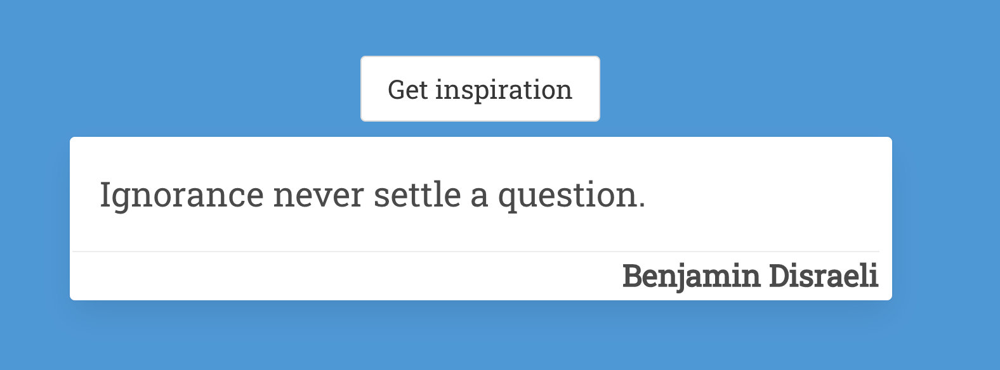
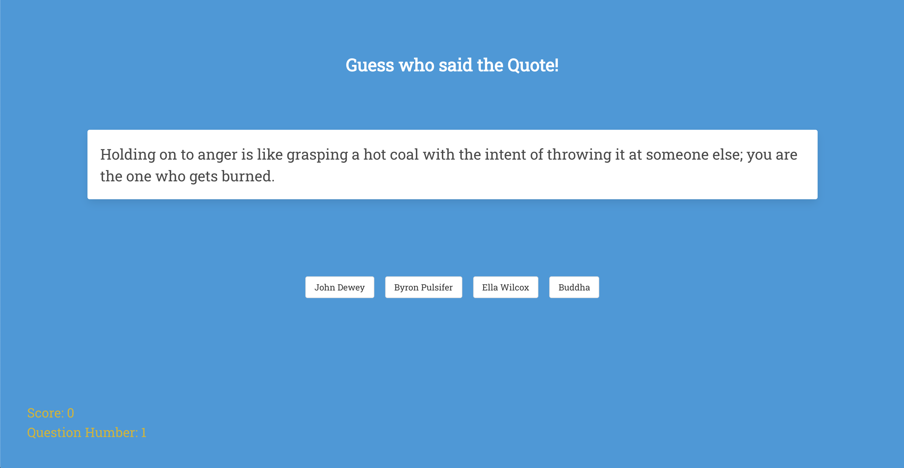
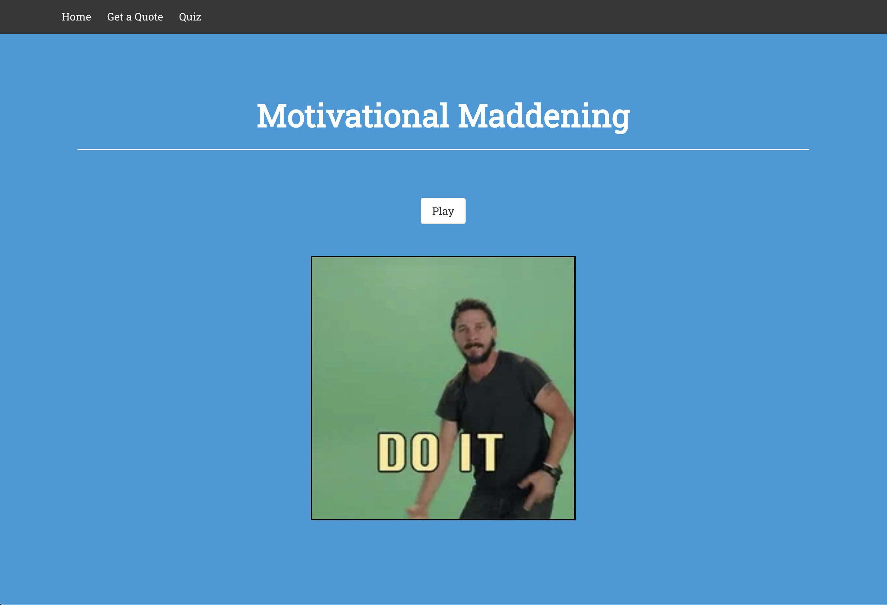

# sei project 2 - Motivational Maddening

## Index
* [Overview](./README.md#overview)
* [Installation](./README.md#installation)
* [Technologies Used](./README.md#technologies-used)
* [Approach](#approach)
  * [Explanations](#explanations)
  * [Thoughts](#thoughts)
* [Conclusion](./README.md#conclusion)
	* [Wins and Challenges](./README.md#wins-and-challenges)
	* [Some Learnings](./README.md#some-learnings)
## Overview 

For my second project in General Assembly's Software Engineering course, in pairs we were tasked with developing a web app with React and an existing API for which we decided to build an interactive random quote generator using NodeJS for the back-end, we had a time span of two days for this project.

## Installation

First we need to download the repository into our own machine for which we have to input the following line into our terminal or command line:
```bash 
git clone https://github.com/DanielFDA/sei-project-2.git
```
then you'll need to install dependencies running `yarn` in either the in-built terminal of your code editor or cmd/terminal, making sure you're inside the root of the project. The address on the terminal should look something like this
```bash 
~/GA/development/PROJECTS/sei-project-2
```
after that you can start the app with `yarn start`


## Technologies Used
* CSS
* JavaScript (ES6)
* HTML5
* React
* SASS

#### Dependencies
* Axios
* React-router-dom

## Approach 

My duo for this project was [Max](https://github.com/maccymg)

Important: Sadly the API that was used for this project has been taken down indefinitely, for learning purposes I will still make the readme and try to explain everything as it was, take into account that this API was simple, it was one JSON file filled with objects (around 2000) and every object would have a quote and it's author. The authors were varied there was no theme to it.

In this section I will do my best to explain what the functions do and how the application works, if you choose you can skip the explanations and go straight to my thought process during the building of this app.

<p align="center" width="100%">
     
</p>

### Explanations

The first thing Max and I did was talk about all the possible ideas and what we wanted to build for this website, previous to sending us onto developing this project we were shown a few examples of other websites made by previous students and they gave us a general idea of what we could build, Max and I chose to make a guess the author quiz.

Once we got hold of the API the first step was to get the data.

```js
  React.useEffect(() => {
    const getData = async () => {
      try {
        const { data } = await getAllQuotes()
        const filteredData = data.filter(item => {
          return item.author
        })
        setQuotes(filteredData)
      } catch (err) {
        console.log(err)
      }
    }
    getData()
  }, [])
```

Here we requested the data from the api, after which we filtered it before setting it to state to make sure that only the quotes that had an author would be used since the API had quotes without a designated author.

Next we'll see how we managed to randomize the position of the quote that would be the right answer of the quiz for one round.

<p align="center" width="100%">
     
</p>

```js
const getOptions = (quotes, quizQuote) => {
    if (!quotes) return []
    const randomOptionsNumber = Math.floor(Math.random() * 4)
    const optionsArray = []
    if (randomOptionsNumber === 0) {
      optionsArray.push(quizQuote)
      for (let i = 0; i < 3; i++) {
        const randomIndex = Math.floor(Math.random() * quotes.length)
        optionsArray.push(quotes[randomIndex])
      }
    } else if (randomOptionsNumber === 1) {
      for (let i = 0; i < 3; i++) {
        const randomIndex = Math.floor(Math.random() * quotes.length)
        optionsArray.push(quotes[randomIndex])
      }
      optionsArray.push(quizQuote)
    } else if (randomOptionsNumber === 2) {
      for (let i = 0; i < 2; i++) {
        const randomIndex = Math.floor(Math.random() * quotes.length)
        optionsArray.push(quotes[randomIndex])
      }
      optionsArray.push(quizQuote)
      const randomIndex = Math.floor(Math.random() * quotes.length)
      optionsArray.push(quotes[randomIndex])
    } else if (randomOptionsNumber === 3) {
      const randomIndex = Math.floor(Math.random() * quotes.length)
      optionsArray.push(quotes[randomIndex])
      optionsArray.push(quizQuote)
      for (let i = 0; i < 2; i++) {
        const randomIndex = Math.floor(Math.random() * quotes.length)
        optionsArray.push(quotes[randomIndex])
      }
    }
    return optionsArray
  }
```

First we checked if the quotes were coming from the API and returned an empty array if there were none, in case there were we created a variable called randomOptionsNumber that was given a random number from 0 to 3, then we created another variable called optionsArray that to begin with we set it to be an empty array.

Then depending on the number that we got from the variable randomOptionsNumber we set the right answer of the quiz to a certain position, in the case that the randomOptionsNumber was equal to 0 the right answer would be located in the first spot, in case it was equal to 1 the right answer would be then located in the last spot, and so on.

For this function we overcomplicated ourselves a little bit but this is how we managed to get it working the fastest, and we didn't have time to go back and refactor things. Take into account that we had just learned the basics of React and working with API's so we were in a hurry to get the website up and running, since we only had 2 days.

Then for the last complex function of this project we have.

```js
  React.useEffect(()=> {
    if (!quotes) return 

    let item = quotes[Math.floor(Math.random() * quotes.length)]
    while (playedAuthors.includes(item.author)) {
      item = { ...quotes[Math.floor(Math.random() * quotes.length)] }
    }
    const options = getOptions(quotes, item)
    setOptions(options)
    setPlayedAuthors([...playedAuthors, item.author])
    setQuizQuote(item)
  }, [game])
```

What this one did was again check if there was quotes coming back from the API, and stop working if there weren't any.

Then we created a variable called item that would be assigned a random quote from the API, checking that said quote wasn't used already in a previous round of the quiz.

After that we created a variable called options tasked with running the function getOptions which would give us all the quotes and the quizquote that would be the right answer for that round. Then we stored everything inside the Options state and stored the author from the right quote of the round in another state so we could compare it for the following rounds. At last we set the right quote to a state called quizQuote.

Then all that was left to do was create the function that would take care of handling the game.

```js 
  const handleGame = (e) => {
    if (game === 10) {
      alert(`You've scored ${correctOption} out of 10 answers right`)
      history.push('/')
    }
    if (e.target.value === quizQuote.author) {
      setCorrectOption(correctOption + 1)
    } else {
      console.log('wrong')
    }
    setGame(game + 1)
  }
```

For this one, we set it so when 10 rounds had passed, the quiz would finish and the app would alert you the score you achieved and then sent you to the home page in case you wanted to play again.

This one took care of comparing the selected option (author) with the right answer of that round (quizQuote.author) and if it was correct you would +1 to your score. At last we set the game counter + 1 all the rounds so when it reaches 10 it stops.


### Thoughts

This app was pretty challenging in terms of logic back when we made it, looking back the API certainly limited the amount of things that we could work with, but even then the time that we had to work with wasn't really enough to do much more than we did so I'm pleased with the result, looking back the getOptions function needs refactoring, the same could be achieved with a lot less code and some of the variable names that we chose have confusing names like "item". 

In general the app was pretty solid but needed more time to smooth things out and look better, with this app as well we couldn't put as much time into styling it due to the short amount of time that we got left after finishing the logic and displaying everything.

The communication here played a huge role because at this point we didn't use git so we were basically sharing code as we went. So it was imperative that we knew what each other was working on, and it's something that we did pretty well, we assisted each other when needed and kept in comms for the biggest part of the day. 

## Conclusion
### Wins and Challenges

The biggest win for this project is the fact that despite it being the first time working with another developer the communication was pretty clear and we always knew what the other person was working on so our structure was pretty well defined and we were capable of achieving everything we considered for the MVP taking into account that we had just learned the basics of React.

My biggest challenge on this project was adapting to the short timeframe, maybe because our planning didn't really account for much styling unless we had the time, something that looking back we should've probably given more time but at the same time the goal was to learn as much React as we could and that's what we focused on. 

### Some Learnings

Most of the learning here was heavily oriented towards knowledge about either the technologies we used or the heavy lifting you can do if you set yourself up to it when you have a short window of time to make something from scratch. Didn't have much to time for specific cases or situations, almost all the time was spent learning how to do stuff and implementing it and fixing any bugs along the way.

This project was one of those that taught me a lot about the basics of React and showed me that there was so much I didn't know about React and programming in general (looking back I'm even more bamboozled now) that kind of scared me in the beginning but also intrigued me a lot and made me want to spent as much time learning as I could, to be able to get to a comfortable level of React and programming in general.

<p align="center" width="100%">
     
</p>

<!-- 
[Index](./README.md##index) -->